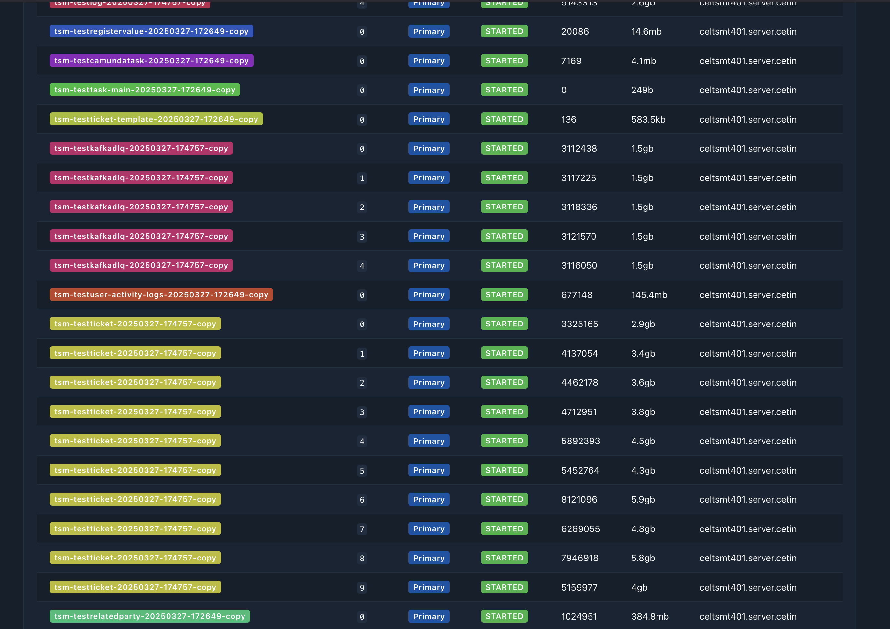
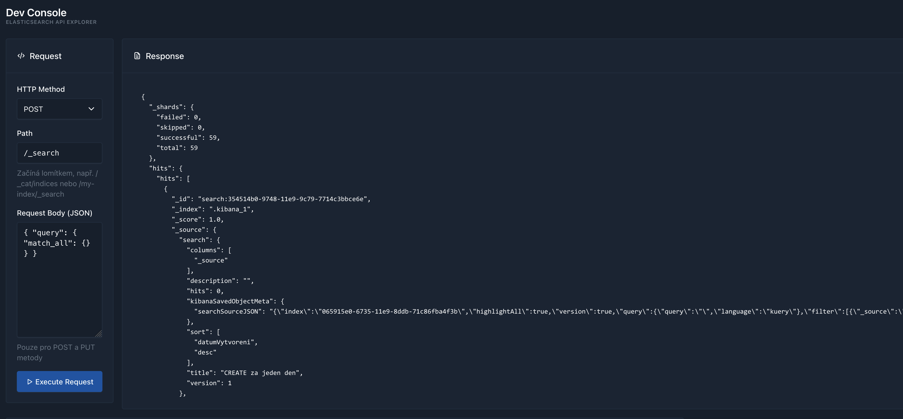

# Elastic Explorer

A modern Elasticsearch cluster explorer written in Rust - a simpler and more intuitive alternative to ElasticVue.

## Features

- 🔍 **Dashboard** - Cluster health, metrics, and node overview
- 📊 **Indices** - List, filter (with regex), bulk operations, and detailed information
- 🔎 **Search** - Query DSL and SQL support with saved queries
- 🖥️ **Dev Console** - Interactive API explorer (like Kibana's Dev Tools)
- 🔧 **Shards** - Visual shard distribution and status
- 📝 **Templates** - Index and component template management
- 🔐 **Secure** - Passwords stored encrypted in the local SQLite database

## Screenshots


*Dashboard with cluster health and metrics*


*Dev Console - Interactive API explorer*

## Quick Start

### Prerequisites

- Rust 1.70 or later
- Elasticsearch 3.x - 8.x

### Build

```bash
cargo build --release
```

### Run

```bash
# Basic usage (server on 127.0.0.1:8080)
cargo run

# Custom port
cargo run -- --port 3000

# Custom host
cargo run -- --host 0.0.0.0 --port 8080

# Don't open browser automatically
cargo run -- --no-browser

# Help
cargo run -- --help
```

### Install

```bash
cargo install --path .
elastic-explorer
```

The application will automatically open in your default browser at http://127.0.0.1:8080

## Configuration

The application creates a data directory based on your operating system:

- **macOS/Linux**: `~/.elastic-explorer/data/`
- **Windows**: `%APPDATA%\elastic-explorer\data\`

This directory contains the SQLite database with endpoint configurations and the encryption key file.

### Password Security

Basic Auth passwords are stored encrypted in the local SQLite database using AES-256-GCM.
The encryption key is generated on first run and stored in `~/.elastic-explorer/db.key`.

Important: back up the entire `~/.elastic-explorer/` directory (the SQLite DB plus `db.key`).
If the key is lost, stored passwords cannot be recovered.

## Documentation

- [Development Progress](docs/PROGRESS.md) - Implementation status
- [Requirements](docs/REQUIREMENTS.md) - Detailed requirements
- [UI Implementation](docs/UI_IMPLEMENTED.md) - UI implementation details
- [Search Improvements](docs/SEARCH_IMPROVEMENTS.md) - Future search enhancements

## Technology Stack

- **Backend**: Axum 0.8, Tokio
- **Database**: SQLite (sqlx)
- **ES Client**: reqwest with custom wrapper
- **Frontend**: HTMX, Server-Sent Events
- **Templates**: Askama
- **UI**: Tabler, Bootstrap 5

## Development

### Important Notes

**Axum 0.8.x syntax:**
- Path parameters use `{param}` instead of `:param`
- Example: `.route("/indices/detail/{index_name}", get(handler))`
- **NOT**: `.route("/indices/detail/:index_name", get(handler))`

### Running Tests

```bash
cargo test
```

### Building for Production

```bash
cargo build --release
```

The binary will be available at `target/release/elastic-explorer`

## License

MIT License - see [LICENSE](LICENSE) file for details

## Contributing

Contributions are welcome! Please feel free to submit a Pull Request.

## Author

Created in 2026
